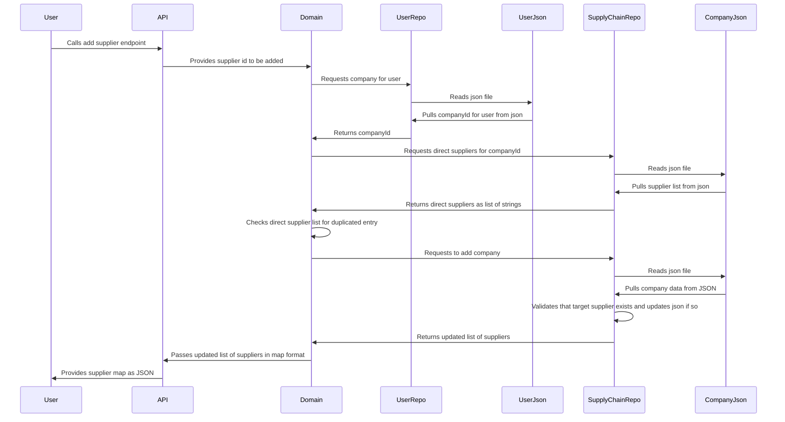

[Mermaid URL](https://mermaid.live/edit#pako:eNq1VE1v2zAM_SuEzt0f8KHAkF5aoF2QoDv5wpl0otWWXFEaFhT976Ms56N2V_TSnBz7vUe-J1IvpvHEpjLCz4ldwzcWdwH72oH-HoXDt-vr7-vbClbYdQJIBJKGobMcgB0N3rpYwIpS7I3v0boK1sH_scRyRluC6OEXZw2mwilopeVKGx58BZvciESBxvcDugO0PkDSz-eWMnDi3Il3mYMk8FufobUdn5H58xv1dcouJulbOolDG3w_KizKHB1tOKbgLsgzC9ts9LDa67-ZE7KBm3hKQsaqM5kZW_VWBfCBwwvEe_WL11P-nZU4t7msOne76B2lKPkWJAbrdjLL4aiw2nPztBCY2tAAKOmLBiOTDlIMh0_HqVOUx3AK8IvjO04hYcSS3t32x8P_ii5EfmJnlap7EPcYIWLY8UUY_NdmR-gI0lBwY5NWw_WfPaLCpPOxHM9qlui4xmsU4Q84YB30OOQT6vHNZueVeG-vM1qHIsdirkzPyrOkN8pLJtcm7rnn2lT6SBiealO7V8Vhin57cI2pYkh8ZUpD0-1jqhY70bdMNvpwX66o8aZ6_Qe-TqZI)